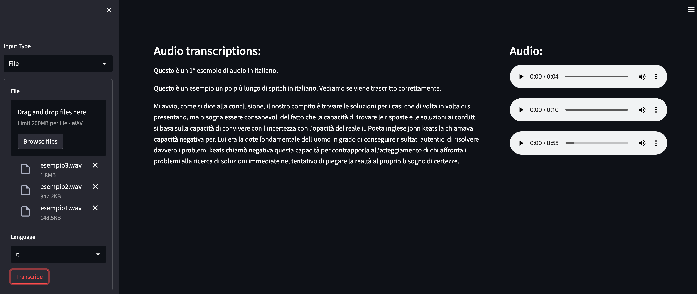

# OCI Speech Demos

This repository contains all the work done for demos on **Oracle OCI Speech Service**

Using OCI Speech Service you can easily get accurate transcription of speech contained in audio files.

You can take a set of audio files (wav, flac format), upload these files to a bucket in the OCI Object Storage and
get json files containing the transcriptions, in few minutes.

In this repository you will find examples and demos showing how to use **OCI Python SDK** to easily transcribe the audio files.

## Languages Supported
* English
* US English
* Spanish
* Italian
* French
* German
* Hindi
* Portuguese

Demos have been tested using: english, italian languages.

## Input format
OCI Speech supports not only **wav** format, but also: **mp3, ogg, oga, webm, ac3, aac, mp4a, flac, amr**.

Demos in this repository have been tested using **wav, flac** format. 

## Demos:
* [demo1](./demo1_main.py): command line demo, takes a list of wav files from a local directory, transcribe the audio and output the result to the screen
* [demo2](./demo2.py): a UI, built with Streamlit, enables you to upload a set of audio files and get back the trascriptions; Supports wav and flac formats.

## Demo Features
In [demo1](./demo1_main.py) you can see: 
* how to copy a set of wav files to Object Storage
* how to **launch an OCI Speech transcription job**
* how to **extract the transcription** from the produced json files.

In [demo2](./demo2.py) you can see:
* how to create a UI for OCI Speech, using [Streamlit](https://streamlit.io/)
* how to **launch a transcription job**
* how to **extract the transcription** from the produced json files.

In [utils](./utils.py):
* how to **wait for job completion**
* clean a remote bucket
* copy files to/from Object Storage

## Sampling rate
* For all languages **16 Khz** is supported. 
* For some languages (english, spanish...) it is also supported 8 Khz.

If you want to check the sampling rate of your files, you can use the utility provided [here](./check_sample_rate.py).

## Configuration
To be able to use OCI Speech and the demos provided some configuration is needed.

If you want to launch the demo from your laptop you need to have created the keys-pair, to be setup in $HOME/.oci directory

For more details on the needed configuration, see the Wiki.

## Dependencies
* oci
* ocifs
* Streamlit
* soundfile
* tqdm

The steps needed to create a dedicated conda environment are listed in the [Wiki page](https://github.com/luigisaetta/oci-speech-demos/wiki/Creating-a-conda-env).

## Quotes
The **sentence** that you see last in the picture is from the book "La misura del tempo", G. Carofiglio, p. 119 in the italian edition.
